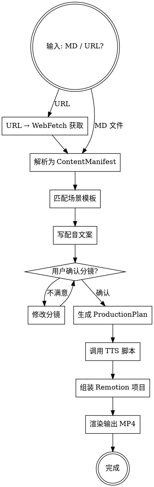

# /reel

文档 → Remotion 视频，六阶段自动流水线。AI 只选择模板和填充参数，不生成 React 代码。

## 决策流程



## 快速参考

### 六阶段

| Stage | 做什么 | 输出 |
|-------|--------|------|
| S1 Researcher | MD/URL → 结构化 JSON | `workdir/content-manifest.json` |
| S2 Screenwriter | 匹配模板 + 写配音 | `workdir/storyboard.json` |
| ⚠️ **确认点** | **暂停，等用户确认分镜** | — |
| S3 Director | 分镜 → 生产计划 | `workdir/production-plan.json` |
| S4 Asset Gen | 批量 TTS 配音+字幕 | `workdir/assets/audio/` + `srt/` |
| S5 Compositor | 组装 Remotion 项目 | `workdir/remotion-project/` |
| S6 Renderer | 渲染输出 | `workdir/out/video.mp4` |

### 模板匹配（严格按此优先级）

```
代码块?      → CodeScene
表格?        → ConfigTableScene
有序列表?    → StepScene
无序列表?    → BulletScene
引用块?      → QuoteScene
有%或数字?   → StatsScene
含"优势/好处"关键词? → BenefitsScene
含"对比/区别"关键词? → CompareScene
H1 标题      → TitleScene (强制开场)
含"总结"     → OutroScene  (强制结尾)
普通段落     → BulletScene  (兜底)
```

完整 Props 接口见 `references/scene-templates.md`。

### 关键命令

```bash
# TTS 单条
python3 scripts/generate-voiceover.py \
  --text "配音文本" --output-audio scene.mp3 --output-srt scene.srt

# TTS 批量
python3 scripts/generate-voiceover-batch.py \
  --plan workdir/production-plan.json --workdir workdir

# 渲染
cd workdir/remotion-project && npm install
npx remotion render Reel out/video.mp4
```

## 各阶段操作指南

### S1 — 解析

1. URL → `WebFetch` 获取 → 转 Markdown
2. 解析为 sections (heading/paragraph/list/code/table/blockquote)
3. 按标题层级分组
4. 输出 ContentManifest JSON

### S2 — 写分镜

1. 按优先级为每个 section 匹配模板
2. 写口语化中文配音（~3 字/秒，口播风格，单条 <200 字）
3. 估算帧数：`字数 / 3 × 1.2 × 30`
4. **强制**: 第一个场景 TitleScene，最后一个 OutroScene
5. **⚠️ 必须暂停等用户确认。禁止跳过。**

### S3 — 生产计划

1. Storyboard → ProductionPlan (帧精确, 30fps)
2. 指定 templateFile、audioFile、srtFile 路径

### S4–S6 — 执行

按命令模板依次调用 TTS → 组装 → 渲染。组装使用 `scripts/compositor.ts`。

## 常见错误

| 错误 | 正确做法 |
|------|---------|
| 跳过用户确认分镜 | S2 后必须暂停等回复 |
| 试图生成新的 React 组件 | 只从 10 个模板选，不写新代码 |
| narration 单个太长 | 拆分为多个场景，每个 <200 字 |
| 忘记开场/结尾 | TitleScene + OutroScene 强制存在 |
| 跳 stage | 严格 S1→S2→确认→S3→S4→S5→S6 |
| 改动模板代码 | 调整 props 或换模板，不改 .tsx |
| 帧数估算随意 | 按公式计算，留 20% 余量 |

## 红旗信号

以下想法出现时，**立即停下来重新检查**：

- "分镜看着没问题，直接继续" → **违规。必须等用户确认。**
- "这个 section 需要自定义组件" → **违规。只用已有模板。**
- "先跳过这个 stage" → **违规。严格按序。**
- "用 AI 生成插图" → **违规。Phase 1 不做 AI 图像。**
- "模板不太合适，改下代码" → **违规。换模板或调 props。**

## 约束

- 中文配音 + 字幕，1920×1080 @ 30fps
- 10 个预编译模板，不生成 React 代码
- 分镜确认是强制步骤，不可跳过
- Phase 1: 无 AI 图像/视频生成、无多语种、无特效音效
- 工作目录: `workdir/`

## 参考

- `references/scene-templates.md` — 模板 Props 详情 + JSON schema
- `references/tts-setup.md` — TTS 语音选项 + 环境配置
- `references/remotion-patterns.md` — Remotion 开发/渲染命令
